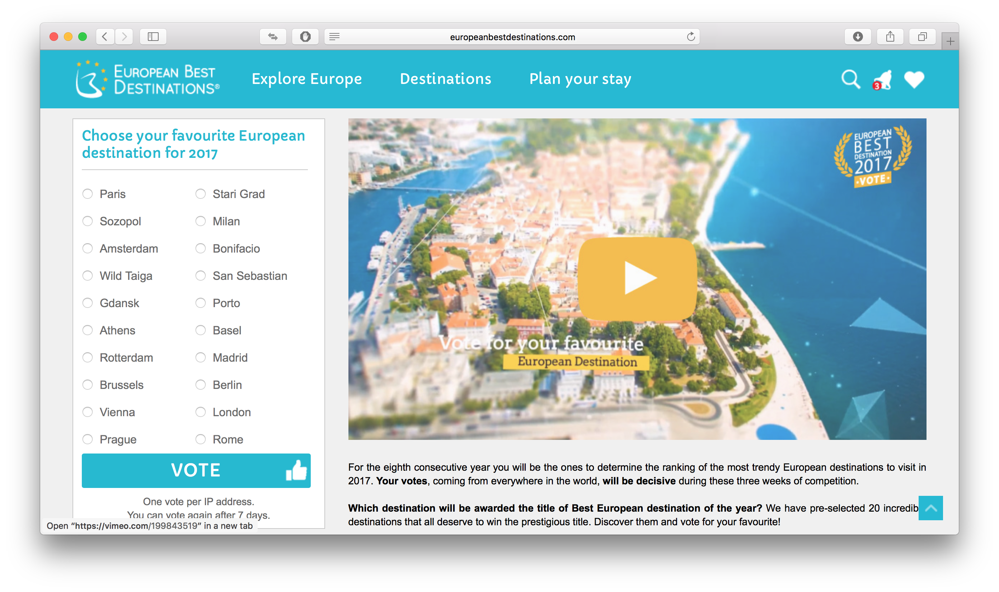
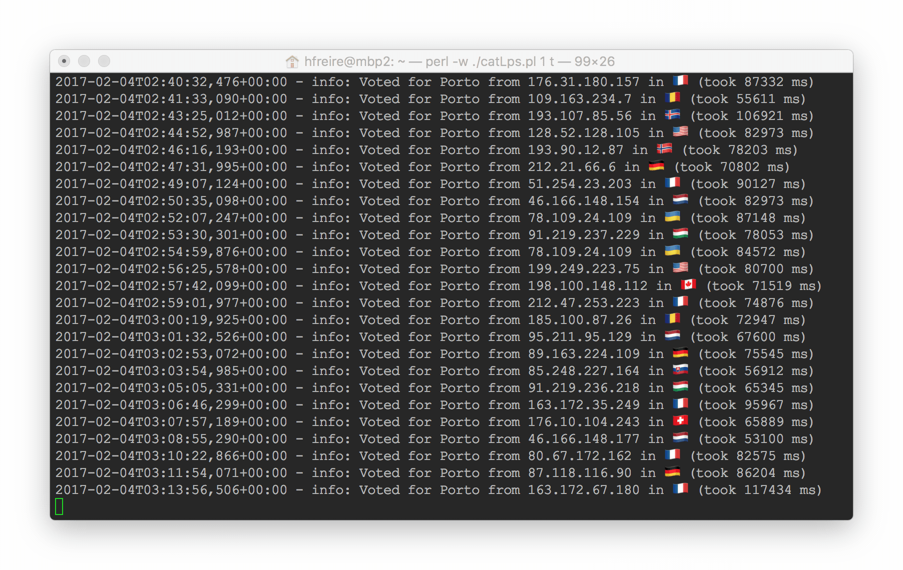
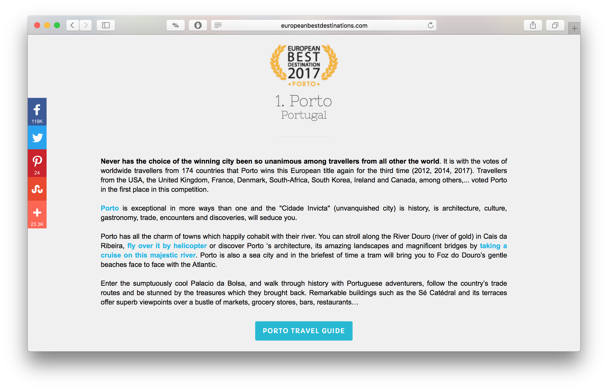

# Let's make :city_sunrise: Porto :trophy: win the :euro: European Best Destination :tada: 2017

[](https://travis-ci.org/hfreire/make-porto-win-european-best-destination-2017)
[](https://coveralls.io/github/hfreire/make-porto-win-european-best-destination-2017?branch=master)
[](https://github.com/hfreire/make-porto-win-european-best-destination-2017/releases)
[](https://hub.docker.com/r/hfreire/make-porto-win-european-best-destination-2017/)
[](https://hub.docker.com/r/hfreire/make-porto-win-european-best-destination-2017/)

> Uses [Pollmommy](https://github.com/hfreire/pollmommy) and [Tor](https://github.com/hfreire/rotating-proxy) to hack the election of Porto as the [European Best Destination 2017](http://www.europeanbestdestinations.com/best-of-europe/european-best-destinations-2017/) from [European Best Destinations](https://http://www.europeanbestdestinations.com).

<p align="center" style="margin-top:-30px;margin-bottom:0px;">
  
</p>

<p>
  
  
</p>

<p align="center" style="margin-top:0px;margin-bottom:0px;">
  
</p>

<p align="center">
  
</p>

### Features
* Bypasses :shipit: the poll voting system :cop: protection: cookie :cookie: and IP address :computer: :white_check_mark:
* Launch :rocket: inside a Docker container :whale: so you don't need to manage the dependencies :raised_hands: :white_check_mark:
* Uses a Tor network setup that is optimized to deliver a different IP address on each vote :white_check_mark:
* Quickly deploy :runner: and easily scale :two_men_holding_hands: the number of voters by using Rancher :white_check_mark:

### How to use

#### Use it in your terminal
Run the Docker image in a container
```
docker run -d -p "3000:3000" hfreire/make-porto-win-european-best-destination-2017
```

#### Use it in with Tor on Mac OS X
Run the Docker image in a cointainer using the Tor network
```
brew install tor
echo "MaxCircuitDirtiness 10" >> /usr/local/etc/tor/torrc
tor &
docker run -p "3000:3000" -e PROXY=socks5://172.17.0.1:9050 -e VOTE_PERIOD=10000 hfreire/make-porto-win-european-best-destination-2017
```

#### Available REST API endpoints
Swagger documentation available at `http://localhost:3000/docs`.

#### Available environment variables
Variable | Description | Required | Default value
:---:|:---:|:---:|:---:
PROXY | Proxy hostname and port that will be used to tunnel the votes. | false |`undefined`
VOTE_PERIOD | Time period (in seconds) between each vote. | false | `5`
OPEN_PAGE_TIMEOUT | Timeout (in seconds) to open poll website. | false | `120`
EXECUTION_TIMEOUT | Timeout (in seconds) to execute the injected code to vote. | false | `90`
PORT | The port to be used by the HTTP server. | false | `3000`
API_KEYS | The secret keys that should be used when securing endpoints. | false | `undefined`
SO_TIMEOUT | TCP socket connection timeout. | false | `120000`
LOG_LEVEL | The log level verbosity. | false | `info`
ENVIRONMENT | The environment the app is running on. | false | `undefined`
ROLLBAR_API_KEY | The server API key used to talk with Rollbar. | false | `undefined`

### How to build
Clone the GitHub repo
```
git clone https://github.com/hfreire/make-porto-win-european-best-destination-2017.git
```

Change current directory
```
cd make-porto-win-european-best-destination-2017
```

Run the NPM script that will build the Docker image
```
npm run build
```

### Limitations
* The number of IP addresses are limited to the [available Tor exit nodes during the voting period](https://metrics.torproject.org/relayflags.html?start=2017-01-20&end=2017-02-10&flag=Exit)

### In the news and social media

<p align="center">
    
</p>

<p align="center">
    
    
</p>

### How to contribute
You can contribute either with code (e.g., new features, bug fixes and documentation) or by [donating 5 EUR](https://paypal.me/hfreire/5). You can read the [contributing guidelines](CONTRIBUTING.md) for instructions on how to contribute with code. 

All donation proceedings will go to the [Sverige för UNHCR](https://sverigeforunhcr.se), a swedish partner of the [UNHCR - The UN Refugee Agency](http://www.unhcr.org), a global organisation dedicated to saving lives, protecting rights and building a better future for refugees, forcibly displaced communities and stateless people.

### License
Read the [license](./LICENSE.md) for permissions and limitations.
